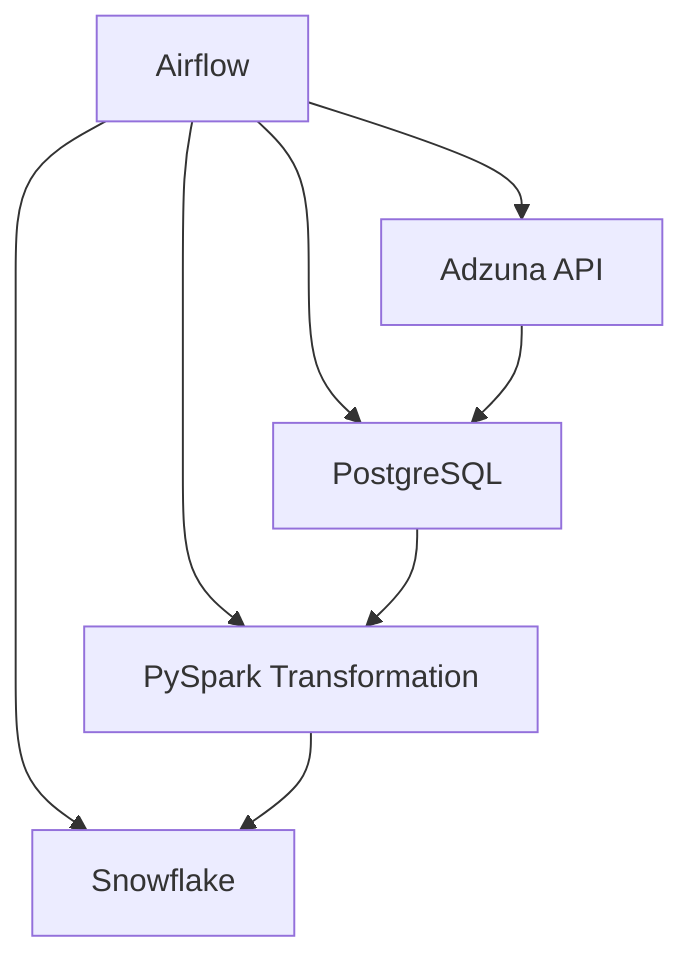

# 🚀 Airflow + PySpark + Snowflake + PostgreSQL + Adzuna API Project

Welcome to the **Data Engineering Pipeline Project**! This project involves extracting job data from the Adzuna API, processing it using PySpark, and storing it in Snowflake and PostgreSQL. The workflow is orchestrated using **Apache Airflow** to automate data ingestion and transformation tasks. 

## 📄 Overview

This project focuses on building a data pipeline to fetch job listings for Data Engineers in the USA using the **Adzuna API**, transform the data using **PySpark**, and load the data into **Snowflake** and **PostgreSQL** databases. The process is managed with **Apache Airflow** to ensure efficient scheduling and monitoring of tasks.

The key objectives of this project:
- Extract real-time job data from Adzuna API.
- Process and clean job data using PySpark.
- Load the transformed data into Snowflake and PostgreSQL.
- Schedule, monitor, and orchestrate tasks with Airflow.

## Data Flow 📈

## 🛠️ Tech Stack

This project utilizes a modern data engineering tech stack to create an efficient and scalable pipeline:

- **Adzuna API**: Job data provider
- **Apache Airflow**: Orchestration and workflow management
- **PySpark**: Data processing and transformation
- **Snowflake**: Cloud-based data warehousing
- **PostgreSQL**: Relational database for storing job data
- **Python**: Core language for script development
- **Docker**: Containerization for consistent development and deployment environments
- **WSL2**: Windows Subsystem for Linux for Linux-based development on Windows

## ⚙️ Installation

To get started with this project, follow the steps below:

### Prerequisites

Ensure you have the following installed:
- **Python 3.10** or higher
- **Docker** and **Docker Compose**
- **Apache Airflow**
- **PySpark**
- **PostgreSQL**
- **Snowflake Account**

## 📈 Data Flow

1. **Extract**: Data is fetched from the **Adzuna API** for Data Engineer job listings.
2. **Transform**: Data is cleaned and processed using **PySpark** for efficient handling of large datasets.
3. **Load**: The transformed data is loaded into both **Snowflake** and **PostgreSQL**.
4. **Orchestrate**: The entire process is automated using **Apache Airflow**, with tasks scheduled at regular intervals.

## 📝 Key Features

- **Real-Time Job Data**: Fetches live job listings from Adzuna API.
- **Efficient Data Processing**: Utilizes PySpark for scalable and parallel data processing.
- **Dual Database Storage**: Loads data into both Snowflake and PostgreSQL for flexible analysis and querying.
- **Automated Orchestration**: Apache Airflow manages task dependencies and execution.

## 📊 Data Schema

The following table schema is used for storing job listings:

| Column        | Type        | Description                  |
|---------------|-------------|------------------------------|
| `job_title`   | STRING      | Title of the job              |
| `company`     | STRING      | Company offering the job      |
| `location`    | STRING      | Job location                  |
| `salary_min`  | INTEGER     | Minimum salary range          |
| `salary_max`  | INTEGER     | Maximum salary range          |
| `created_date`| TIMESTAMP   | Date job was posted           |
| `job_category`| STRING      | Job category                  |
| `job_description`| STRING   | Full description of the job   |

